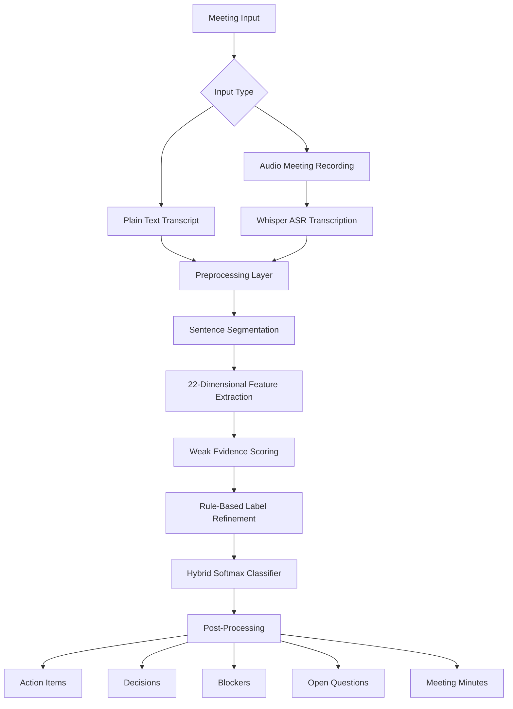

# MIESA-HC

# MIESA-HC: Meeting Intent Evidence Scoring Algorithm with Hybrid Classification

## Overview

**MIESA-HC** stands for **Meeting Intent Evidence Scoring Algorithm with Hybrid Classification**.  
It is a lightweight and interpretable meeting-intelligence framework designed to convert raw meeting transcripts or audio-based meeting recordings into structured, actionable outputs.

Traditional meeting summarization systems mainly generate a short summary of the meeting. However, a summary alone does not clearly answer practical questions such as:

- Who is responsible for the next task?
- What decision was finally taken?
- What is blocking the progress?
- Which questions are still open?
- What should be included in the final meeting minutes?

MIESA-HC addresses this gap by performing **sentence-level meeting intent classification** and post-processing. Each sentence in a meeting transcript is classified into one of five meeting-specific categories:

1. **Action**
2. **Decision**
3. **Blocker**
4. **Question**
5. **Discussion**

Along with classification, the system also extracts:

- Assignee information
- Deadline cues
- Priority level
- Action items
- Decisions
- Blockers
- Open questions
- Structured meeting minutes

The framework is designed to be computationally efficient, reproducible in Google Colab, and usable without depending fully on large pretrained language models.

---

## Project Title

**MIESA-HC: A Weakly Supervised Hybrid Framework for Meeting Intelligence**

---

## Problem Statement

Meetings generate a large amount of valuable information, but most of this information remains in unstructured form. In academic, organizational, and professional meetings, important points such as decisions, action items, blockers, and open questions are often hidden inside long transcripts.

After a meeting, someone usually has to manually read the transcript and prepare meeting minutes. This process is:

- Time-consuming
- Error-prone
- Inconsistent
- Difficult to scale
- Dependent on human attention

Existing meeting-processing systems mostly focus on summarization. While summarization is useful, it may not clearly identify actionable meeting outcomes. Therefore, there is a need for a lightweight and interpretable system that can extract structured meeting intelligence from transcripts.

---

## Aim of the Project

The main aim of MIESA-HC is to develop a meeting-intelligence system that can automatically analyze meeting transcripts and generate structured outputs such as action items, decisions, blockers, open questions, and meeting minutes.

---

## Objectives

The major objectives of this project are:

- To classify meeting sentences into meaningful intent categories.
- To reduce manual effort required in preparing meeting minutes.
- To identify actionable tasks from meeting transcripts.
- To detect decisions taken during a meeting.
- To identify blockers or risks mentioned during discussions.
- To extract open questions that require follow-up.
- To infer assignees, deadlines, and priority levels.
- To design a lightweight model that does not require heavy pretrained transformer models.
- To provide a practical Gradio-based interface for text and audio-based meeting inputs.

---

## Key Features

- Sentence-level meeting intent classification
- Weak supervision-based label generation
- Rule-based label refinement
- Human-corrected gold-label integration
- Handcrafted feature engineering
- Weighted softmax classifier implemented using NumPy
- Text-based meeting transcript analysis
- Audio-based meeting analysis using Whisper transcription
- Optional speaker diarization support
- Gradio web interface
- Monitoring dashboard for meeting statistics
- Meeting minutes generation
- Exportable JSON and text outputs

---

## Meeting Intent Classes

MIESA-HC classifies each sentence into one of the following five classes:

| Class | Meaning | Example |
|---|---|---|
| Action | A task or activity that needs to be done | "Rahul will submit the final report by Friday." |
| Decision | A final agreement or conclusion | "We agreed to use Google Colab for model training." |
| Blocker | A problem, risk, or dependency | "The deployment is blocked due to authentication failure." |
| Question | A query or unresolved issue | "Can we complete the testing before Monday?" |
| Discussion | General conversation or background information | "The team reviewed the current project status." |

---

## Theoretical Background

### 1. Meeting Intelligence

Meeting intelligence refers to the process of automatically extracting useful and structured information from meeting conversations. Unlike simple summarization, meeting intelligence focuses on identifying practical meeting outcomes.

A meeting-intelligence system should be able to answer:

- What was discussed?
- What was decided?
- What tasks were assigned?
- Who is responsible?
- What deadlines were mentioned?
- What risks or blockers were raised?
- What questions remain unanswered?

MIESA-HC is built around this idea. Instead of only generating a paragraph summary, it creates structured meeting outputs that are directly useful for follow-up work.

---

### 2. Weak Supervision

Weak supervision is a machine learning approach where training labels are generated using rules, heuristics, patterns, or programmatic logic instead of full manual annotation.

In this project, sentence-level gold labels are not directly available in the MeetingBank dataset. Therefore, the system first creates weak labels automatically using evidence scores.

For example:

- Sentences with words like "will", "assign", "complete", or "submit" may indicate an **Action**.
- Sentences with phrases like "we decided", "approved", or "agreed" may indicate a **Decision**.
- Sentences with words like "blocked", "issue", "delay", or "problem" may indicate a **Blocker**.
- Sentences ending with a question mark may indicate a **Question**.
- Sentences that do not strongly match other classes may be treated as **Discussion**.

Weak supervision reduces the need for large manually annotated datasets and makes the project more practical in low-resource academic settings.

---

### 3. Hybrid Classification

The term **Hybrid Classification** in MIESA-HC means that the final system does not rely on only one technique. Instead, it combines multiple components:

1. **Handcrafted feature extraction**
2. **Weak evidence scoring**
3. **Rule-based label refinement**
4. **Human-corrected gold-label integration**
5. **Weighted softmax classification**

This hybrid design improves interpretability and allows the system to work without depending completely on large pretrained transformer models.

---

## Proposed Methodology

The complete MIESA-HC pipeline follows six major stages:

```text
Input Meeting Transcript / Audio
              |
              v
       Preprocessing
              |
              v
     Feature Extraction
              |
              v
   Weak Evidence Scoring
              |
              v
    Rule-Based Refinement
              |
              v
   Hybrid Softmax Classifier
              |
              v
      Post-Processing
              |
              v
Structured Meeting Intelligence

```
## Meeting Intent Evidence Scoring Algorithm with Hybrid Classification

**MIESA-HC** is a weakly supervised hybrid framework for meeting intelligence.  
It converts raw meeting transcripts or audio recordings into structured meeting outputs such as **Action Items**, **Decisions**, **Blockers**, **Questions**, and **Discussion** points.

The project is designed to move beyond simple meeting summarization by identifying practical and actionable information from meeting conversations.

---

## Table of Contents

- [Overview](#overview)
- [Problem Statement](#problem-statement)
- [System Architecture](#system-architecture)
- [Input Layer](#1-input-layer)
- [Preprocessing Layer](#2-preprocessing-layer)
- [Feature Extraction Layer](#3-feature-extraction-layer)
- [Weak Evidence Scoring](#weak-evidence-scoring)
- [Rule-Based Label Refinement](#rule-based-label-refinement)
- [Hybrid Gold-Label Integration](#hybrid-gold-label-integration)
- [Classifier](#classifier)
- [Post-Processing](#post-processing)
- [Dataset](#dataset)
- [Model Stages](#model-stages)
- [Experimental Results](#experimental-results)
- [Technology Stack](#technology-stack)
- [Installation](#installation)
- [Suggested Project Structure](#suggested-project-structure)
- [Running the Project](#running-the-project)
- [Text-Based Usage](#text-based-usage)
- [Audio-Based Usage](#audio-based-usage)
- [Gradio Interface](#gradio-interface)
- [Output Files](#output-files)
- [Limitations](#limitations)
- [Future Scope](#future-scope)
- [Citation](#citation)
- [Author](#author)
- [License](#license)

---

## Overview

Meetings generate a large amount of useful information, but most of it remains in an unstructured format. Important points such as assigned tasks, final decisions, blockers, deadlines, and unresolved questions are often hidden inside long meeting transcripts.

**MIESA-HC** solves this problem by performing sentence-level meeting intent classification.

Each sentence is classified into one of the following five classes:

| Class | Meaning |
|---|---|
| Action | A task or responsibility that needs to be completed |
| Decision | A final agreement, approval, or conclusion |
| Blocker | A problem, issue, risk, or dependency |
| Question | An open query or unresolved discussion point |
| Discussion | General meeting conversation or background context |

The system also extracts additional structured information such as:

- Assignee
- Deadline
- Priority
- Meeting minutes
- Action list
- Decision list
- Blocker list
- Open questions

---

## Problem Statement

Most meeting-processing systems focus mainly on summarization. A summary is useful, but it may not clearly answer important practical questions such as:

- Who has to complete the task?
- What was finally decided?
- What is blocking the project?
- Which issues are still open?
- What should be added to the meeting minutes?

Manual preparation of meeting minutes is time-consuming, inconsistent, and error-prone.  
Therefore, there is a need for a lightweight and interpretable meeting intelligence system that can automatically extract structured meeting outcomes.

---

## System Architecture

The system contains the following major layers:

1. Input Layer
2. Preprocessing Layer
3. Feature Extraction Layer
4. Weak Evidence Scoring
5. Rule-Based Label Refinement
6. Hybrid Gold-Label Integration
7. Classifier
8. Post-Processing Layer
9. Output Generation



---

## 1. Input Layer

The system accepts two types of inputs:

- Plain text transcript
- Audio meeting recording

For audio input, the system uses **Whisper-based Automatic Speech Recognition** to convert speech into text.

### Input Flow

```text
Audio Meeting Recording
        |
        v
Whisper Speech Recognition
        |
        v
Generated Transcript
        |
        v
MIESA-HC Pipeline
```

---

## 2. Preprocessing Layer

The raw transcript is cleaned and divided into sentence-level units.

This stage includes:

- Text cleaning
- Whitespace normalization
- Sentence segmentation
- Removal of formatting noise
- Tokenization

### Example

Input:

```text
Rahul will prepare the final report by Friday. Can we review it on Monday?
```

After preprocessing:

```text
1. Rahul will prepare the final report by Friday.
2. Can we review it on Monday?
```

---

## 3. Feature Extraction Layer

Each sentence is converted into a handcrafted feature vector.

The final version of the system uses a **22-dimensional feature representation**.

The features are grouped into four major categories:

---

### 3.1 Lexical Features

Lexical features detect intent-specific word patterns.

Examples:

- Action-word density
- Decision-word density
- Blocker-word density
- Question-word density

These features help identify whether a sentence contains words related to tasks, decisions, problems, or questions.

---

### 3.2 Structural Features

Structural features capture the form and structure of a sentence.

Examples:

- Sentence length
- Question mark indicator
- Starts-with-question-word indicator
- Digit presence
- Title-case ratio
- Colon flag
- Exclamation flag

These features help identify sentence-level patterns such as questions, formal decisions, or emphasized blockers.

---

### 3.3 Temporal and Commitment Features

These features identify task-related or deadline-related signals.

Examples:

- Time-expression ratio
- Commitment ratio
- Deadline pattern score

They are useful for detecting action items and assigned responsibilities.

---

### 3.4 Meeting-Specific Features

These features capture meeting-specific context.

Examples:

- Summary overlap score
- Sentence position score
- Negation ratio
- Blocker severity ratio
- Dependency ratio
- Open-question score
- Decision certainty ratio
- Pronoun ratio

These features improve the system's ability to separate general discussion from important meeting outcomes.

---

## 22-Dimensional Feature Set

| Feature Group | Feature Name | Purpose |
|---|---|---|
| Lexical | Action-word density | Detects task-related words |
| Lexical | Decision-word density | Detects decision-related words |
| Lexical | Blocker-word density | Detects issue or risk-related words |
| Lexical | Question-word density | Detects question-related words |
| Structural | Sentence length | Captures sentence size |
| Structural | Question mark indicator | Detects direct questions |
| Structural | Starts-with-question-word | Detects interrogative structure |
| Structural | Digit presence | Detects dates, numbers, or deadlines |
| Structural | Title-case ratio | Helps identify names or entities |
| Structural | Colon flag | Detects structured statements |
| Structural | Exclamation flag | Detects urgency or emphasis |
| Temporal | Time-expression ratio | Detects time-related terms |
| Temporal | Commitment ratio | Detects responsibility cues |
| Temporal | Deadline pattern score | Detects deadline expressions |
| Meeting-Specific | Summary overlap score | Measures relevance to meeting summary |
| Meeting-Specific | Sentence position score | Uses position in meeting transcript |
| Meeting-Specific | Negation ratio | Helps identify blockers |
| Meeting-Specific | Blocker severity ratio | Detects severe issues |
| Meeting-Specific | Dependency ratio | Detects dependency-related blockers |
| Meeting-Specific | Open-question score | Detects unresolved questions |
| Meeting-Specific | Decision certainty ratio | Detects strong decisions |
| Meeting-Specific | Pronoun ratio | Helps identify assigned responsibility |

---

## Weak Evidence Scoring

For every sentence, the system calculates an evidence score for each class.

Let a sentence be represented as:

```text
x(s) = [f1(s), f2(s), ..., f22(s)]
```

where each `f` represents one handcrafted feature.

For each class `c`, the evidence score is calculated as:

```text
Ec(s) = Σ wc,i × fi(s)
```

where:

- `Ec(s)` is the evidence score of sentence `s` for class `c`
- `wc,i` is the class-specific weight for feature `i`
- `fi(s)` is the value of feature `i` for sentence `s`

The initial weak label is assigned using:

```text
ŷweak(s) = argmax Ec(s)
```

If no class receives a strong score, the sentence is assigned to the default class:

```text
Discussion
```

This step allows the system to automatically generate weak sentence-level labels from raw transcripts.

---

## Rule-Based Label Refinement

After weak label generation, deterministic rules are applied to improve label quality.

Examples:

- If a sentence ends with `?`, it is refined as **Question**.
- If a sentence starts with words like `what`, `why`, `how`, `when`, or `can`, it may be refined as **Question**.
- If a sentence contains blocker words along with severity or negation terms, it may be refined as **Blocker**.
- If a sentence contains strong agreement phrases such as `we agreed` or `it is decided`, it may be refined as **Decision**.

This stage improves the quality of automatically generated labels before final model training.

---

## Hybrid Gold-Label Integration

The system also supports human-corrected gold labels.

A subset of weakly labelled data is manually reviewed and corrected. These corrected samples are then given higher importance during training.

In the final model:

| Sample Type | Weight |
|---|---|
| Weakly labelled samples | Normal weight |
| Human-corrected gold-labelled samples | Higher weight |

This helps the classifier learn more reliable decision boundaries while still using a large weakly labelled dataset.

---

## Classifier

The final classifier is a weighted softmax classifier implemented from scratch using **NumPy**.

The classifier uses a linear transformation followed by softmax:

```text
z = Wx + b
```

```text
P(y = c | x) = exp(zc) / Σ exp(zj)
```

The model is trained using class-weighted and sample-weighted cross-entropy loss with L2 regularization.

```text
L = -1/N Σ αi βi Σ yic log(Pic) + λ ||W||²
```

where:

- `αi` is the class weight
- `βi` is the sample weight
- `λ` is the regularization coefficient
- `W` is the weight matrix
- `P` is the predicted probability

This design helps handle class imbalance, especially because the **Discussion** class dominates the dataset.

---

## Post-Processing

After classification, post-processing is applied to make the output more useful.

The post-processing layer performs:

- Assignee extraction
- Deadline extraction
- Priority inference
- Duplicate removal
- Meeting-minutes generation
- Output grouping by class

---

## Assignee Extraction

The system identifies possible assignees by looking for proper nouns or names near action-related expressions.

### Example

Input:

```text
Ankit will submit the final report by Friday.
```

Output:

```json
{
  "assignee": "Ankit",
  "deadline": "Friday",
  "label": "Action"
}
```

---

## Deadline Extraction

The system detects temporal expressions such as:

- by Friday
- before tomorrow
- next week
- by evening
- on Monday

---

## Priority Inference

Priority is inferred using rules:

| Priority | Condition |
|---|---|
| High | Blocker or severe issue |
| Medium | Clear task assignment |
| Low | General or low-risk item |

---

## Dataset

The project uses the **MeetingBank** dataset.

MeetingBank contains real meeting transcripts and summaries. Since the dataset is originally organized at meeting level, the transcripts are converted into sentence-level units during preprocessing.

---

## Dataset Split Used

| Split | Meetings | Sentence Units |
|---|---:|---:|
| Train | 5,169 | 65,841 |
| Validation | 861 | 11,897 |
| Test | 862 | 12,444 |

The dataset is highly imbalanced because most meeting sentences belong to the **Discussion** category.  
Therefore, **macro F1-score** is more useful than accuracy for evaluation.

---

## Model Stages

The project evaluates three model stages.

---

### 1. Base Model

The base model uses:

- Initial 14-dimensional feature set
- Weak labels only

---

### 2. Enhanced Model

The enhanced model uses a 22-dimensional feature set with additional meeting-specific features such as:

- Deadline pattern score
- Commitment cues
- Blocker severity indicators
- Open-question signals

---

### 3. Hybrid Gold Model

The final model uses:

- Full 22-dimensional features
- Refined weak labels
- Human-corrected gold labels
- Class-weighted training
- Sample-weighted training

---

## Experimental Results

### Overall Model Comparison

| Metric | Base Model | Enhanced Model | Hybrid Gold Model |
|---|---:|---:|---:|
| Validation Accuracy | 0.0697 | 0.6556 | 0.8332 |
| Validation Macro F1 | 0.0930 | 0.3365 | 0.7412 |
| Test Accuracy | 0.0624 | 0.6599 | 0.6946 |
| Test Macro F1 | 0.0922 | 0.3260 | 0.3270 |

The results show that the model improves progressively from the base model to the enhanced model and finally to the hybrid gold model.

The best validation performance is achieved by the Hybrid Gold Model:

```text
Validation Macro F1 = 0.7412
Validation Accuracy = 0.8332
```

---

## Per-Class Performance

| Class | Precision | Recall | F1-score |
|---|---:|---:|---:|
| Action | 0.2909 | 0.6216 | 0.3963 |
| Decision | 0.3790 | 0.6311 | 0.4736 |
| Blocker | 0.9351 | 0.9954 | 0.9643 |
| Question | 1.0000 | 0.9495 | 0.9741 |
| Discussion | 0.9554 | 0.8470 | 0.8980 |

The system performs strongly for **Question**, **Blocker**, and **Discussion** classes because these classes have clearer lexical and structural patterns.

**Action** and **Decision** remain more challenging because they often depend on context and subtle wording.

---

## Ablation Study

| Configuration | Validation Accuracy | Validation F1 | Test Accuracy | Test F1 |
|---|---:|---:|---:|---:|
| Basic features | 0.8360 | 0.7388 | 0.7014 | 0.3273 |
| No summary overlap | 0.8024 | 0.7205 | 0.6661 | 0.3165 |
| No deadline/open-question | 0.8290 | 0.7364 | 0.6906 | 0.3258 |
| Full hybrid features | 0.8332 | 0.7412 | 0.6946 | 0.3270 |

The ablation study shows that the complete 22-dimensional feature set gives the strongest validation macro F1-score.

---

## Hyperparameter Configuration

The best configuration used in the final model is:

| Parameter | Value |
|---|---:|
| Learning Rate | 0.02 |
| L2 Regularization | 0.0001 |
| Batch Size | 256 |
| Sample Weight for Gold Labels | 3.0 |

---

## Technology Stack

| Component | Technology |
|---|---|
| Programming Language | Python |
| Numerical Computing | NumPy |
| Data Processing | Pandas |
| Dataset Loading | Hugging Face Datasets |
| Visualization | Matplotlib |
| Audio Processing | librosa, soundfile |
| Speech Recognition | faster-whisper |
| Speaker Diarization | pyannote.audio |
| Interface | Gradio |
| Environment | Google Colab |

---

## Installation

Clone the repository:

```bash
git clone <your-github-repository-url>
cd MIESA-HC
```

Install required dependencies:

```bash
pip install datasets
pip install numpy pandas matplotlib tqdm
pip install gradio
pip install faster-whisper librosa soundfile pydub ffmpeg-python
pip install torch
pip install pyannote.audio
```

---

## Suggested Project Structure

```text
MIESA-HC/
│
├── README.md
├── requirements.txt
├── AI_WORK.ipynb
│
├── src/
│   ├── preprocessing.py
│   ├── feature_extraction.py
│   ├── weak_labeling.py
│   ├── label_refinement.py
│   ├── classifier.py
│   ├── postprocessing.py
│   ├── audio_pipeline.py
│   └── app.py
│
├── models/
│   ├── hybrid_model_W.npy
│   ├── hybrid_model_b.npy
│   ├── hybrid_feature_mean.npy
│   └── hybrid_feature_std.npy
│
├── outputs/
│   ├── meeting_output.json
│   ├── meeting_minutes.txt
│   └── monitoring_log.csv
│
└── docs/
    └── MIESA-HC_Paper.pdf
```

---

## Running the Project

### Run in Google Colab

Open the notebook:

```text
AI_WORK.ipynb
```

Run all cells step by step.

The notebook performs:

1. Dataset loading
2. Text preprocessing
3. Feature extraction
4. Weak label generation
5. Rule-based refinement
6. Model training
7. Evaluation
8. Audio pipeline execution
9. Gradio interface launch
10. Output export

---

## Text-Based Usage

### Example Input

```text
The team agreed to complete the UI design by Friday.
Rahul will prepare the deployment report.
The API integration is blocked due to authentication issues.
Can we finalize the testing plan tomorrow?
```

### Expected Output

```json
{
  "actions": [
    {
      "sentence": "Rahul will prepare the deployment report.",
      "label": "Action",
      "assignee": "Rahul",
      "priority": "Medium"
    }
  ],
  "decisions": [
    {
      "sentence": "The team agreed to complete the UI design by Friday.",
      "label": "Decision"
    }
  ],
  "blockers": [
    {
      "sentence": "The API integration is blocked due to authentication issues.",
      "label": "Blocker",
      "priority": "High"
    }
  ],
  "questions": [
    {
      "sentence": "Can we finalize the testing plan tomorrow?",
      "label": "Question"
    }
  ]
}
```

---

## Audio-Based Usage

The audio pipeline converts meeting audio into text using Whisper and then passes the transcript through the MIESA-HC pipeline.

### Audio Flow

```text
Audio File
   |
   v
Whisper Transcription
   |
   v
Sentence Segmentation
   |
   v
MIESA-HC Classification
   |
   v
Structured Meeting Output
```

Optional diarization can be added using `pyannote.audio` to identify different speakers.

---

## Gradio Interface

The project includes a Gradio-based interface with three major sections.

---

### 1. Text Input Tab

Users can paste a meeting transcript and run the MIESA-HC pipeline.

---

### 2. Audio Input Tab

Users can upload a meeting audio file.  
The system transcribes the audio and extracts structured meeting intelligence.

---

### 3. Monitoring Tab

The monitoring dashboard displays previous run statistics such as:

- Total sentences
- Number of actions
- Number of decisions
- Number of blockers
- Number of questions
- Average confidence score

---

## Output Files

| File | Description |
|---|---|
| `meeting_output.json` | Complete structured output |
| `meeting_minutes.txt` | Formatted meeting minutes |
| `monitoring_log.csv` | Log of model runs |
| `audio_hybrid_output.json` | Output generated from audio input |
| `speaker_hybrid_output.json` | Output with speaker-aware information |

---

## Sample Meeting Minutes Format

```text
MEETING MINUTES

1. Action Items
- Rahul will prepare the deployment report.
- The testing team will validate the final build by Friday.

2. Decisions
- The team agreed to use Google Colab for model training.
- The deployment plan was approved.

3. Blockers
- API integration is blocked due to authentication failure.
- Dataset cleaning is delayed because of missing values.

4. Open Questions
- Can we complete the testing before Monday?
- Who will prepare the final documentation?

5. Summary
The meeting focused on project progress, pending tasks, blockers, and upcoming deadlines.
```

---

## Why MIESA-HC Is Different

| Traditional Summarization | MIESA-HC |
|---|---|
| Produces general summary | Produces structured meeting intelligence |
| Often depends on large models | Uses lightweight handcrafted features and NumPy classifier |
| May miss action items | Explicitly identifies action items |
| May not separate blockers and decisions | Separates Action, Decision, Blocker, Question, and Discussion |
| Less interpretable | More interpretable and rule-guided |
| Usually text-only | Supports text and audio input |

---

## Limitations

The current version has some limitations:

- The early training stage depends on weak labels.
- Action and Decision classes are difficult because they require deeper context.
- Sentence-level classification may miss multi-turn intent.
- Assignee and deadline extraction are heuristic.
- The model still requires stronger generalization on unseen meeting domains.
- Speaker-aware attribution needs further improvement.
- Multilingual and Hinglish support can be improved in future versions.

---

## Future Scope

Future improvements may include:

- Larger manually annotated meeting-intent dataset
- Context-aware classification using previous and next sentences
- Speaker diarization-based assignee detection
- Multilingual and Hinglish meeting support
- Integration with Google Calendar
- Integration with task-management tools
- Email-based action-item reminders
- Improved transformer-assisted hybrid model
- Real-time meeting intelligence dashboard
- Enterprise deployment support

---

## Research Contribution

The main contribution of MIESA-HC is that it demonstrates a complete and reproducible pathway from raw meeting transcripts to structured meeting outputs using a lightweight, interpretable, and weakly supervised hybrid approach.

The project shows that useful meeting intelligence can be achieved without depending fully on heavy pretrained models. It combines weak supervision, rule-based reasoning, human correction, and a NumPy-based classifier into a single practical framework.

---

## Applications

MIESA-HC can be used in:

- Academic meetings
- Corporate meetings
- Project review meetings
- Team standups
- Research discussions
- Administrative meetings
- Client meetings
- Training sessions
- Online class discussions
- Government or public meeting analysis

---

## Requirements

A sample `requirements.txt` file:

```text
datasets
numpy
pandas
matplotlib
tqdm
gradio
faster-whisper
librosa
soundfile
pydub
ffmpeg-python
torch
pyannote.audio
```

---

## Reproducibility

The project is designed to run in Google Colab without mandatory GPU dependency for the main classifier.  
The audio pipeline may benefit from GPU acceleration, especially during Whisper transcription.

To reproduce the results:

1. Open the notebook in Google Colab.
2. Install all required dependencies.
3. Load the MeetingBank dataset.
4. Run preprocessing and feature extraction.
5. Generate weak labels.
6. Apply rule-based refinement.
7. Train the base, enhanced, and hybrid models.
8. Evaluate using accuracy and macro F1-score.
9. Launch the Gradio interface.

---

## Citation

If you use this project, please cite:

```bibtex
@misc{miesahc2026,
  title = {MIESA-HC: A Weakly Supervised Hybrid Framework for Meeting Intelligence},
  author = {Shridhar Pandey},
  year = {2026},
  note = {Meeting Intent Evidence Scoring Algorithm with Hybrid Classification}
}
```

---

## Author

**Shridhar Pandey**  
School of Computing and Artificial Intelligence  
Lovely Professional University  
Jalandhar, India  

---

## License

Copyright (c) 2026 Shridhar Pandey

Permission is hereby granted, free of charge, to any person obtaining a copy
of this software and associated documentation files (the "Software"), to deal
in the Software without restriction, including without limitation the rights
to use, copy, modify, merge, publish, distribute, sublicense, and/or sell  
copies of the Software, and to permit persons to whom the Software is  
furnished to do so, subject to the following conditions:

The above copyright notice and this permission notice shall be included in all  
copies or substantial portions of the Software.

THE SOFTWARE IS PROVIDED "AS IS", WITHOUT WARRANTY OF ANY KIND, EXPRESS OR  
IMPLIED, INCLUDING BUT NOT LIMITED TO THE WARRANTIES OF MERCHANTABILITY,  
FITNESS FOR A PARTICULAR PURPOSE AND NONINFRINGEMENT. IN NO EVENT SHALL THE  
AUTHORS OR COPYRIGHT HOLDERS BE LIABLE FOR ANY CLAIM, DAMAGES OR OTHER  
LIABILITY, WHETHER IN AN ACTION OF CONTRACT, TORT OR OTHERWISE, ARISING FROM,  
OUT OF OR IN CONNECTION WITH THE SOFTWARE OR THE USE OR OTHER DEALINGS IN THE  
SOFTWARE.

---

## Repository Status

| Item | Status |
|---|---|
| Current Version | Research Prototype |
| Deployment | Gradio Demo |
| Environment | Google Colab |
| Main Model | NumPy-based Weighted Softmax Classifier |
| Input Support | Text and Audio |
| Output Support | JSON, Text Meeting Minutes, Monitoring Logs |

